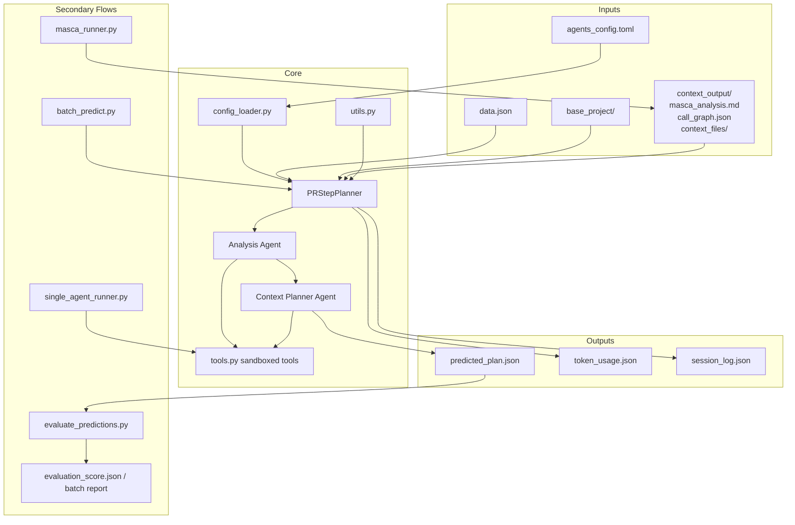
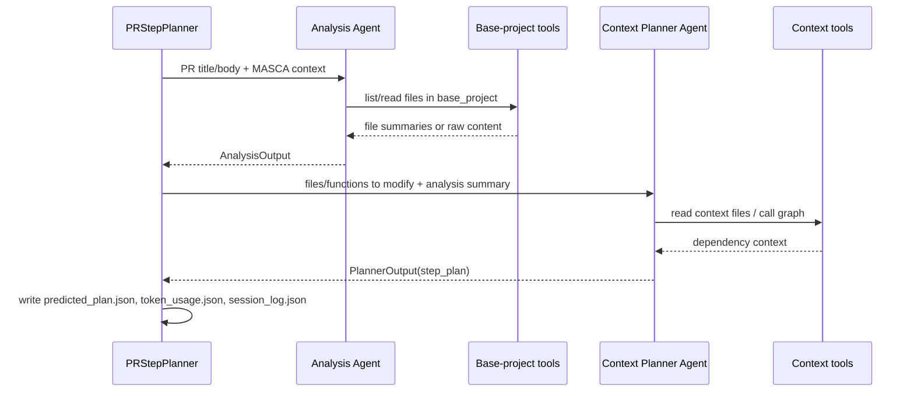
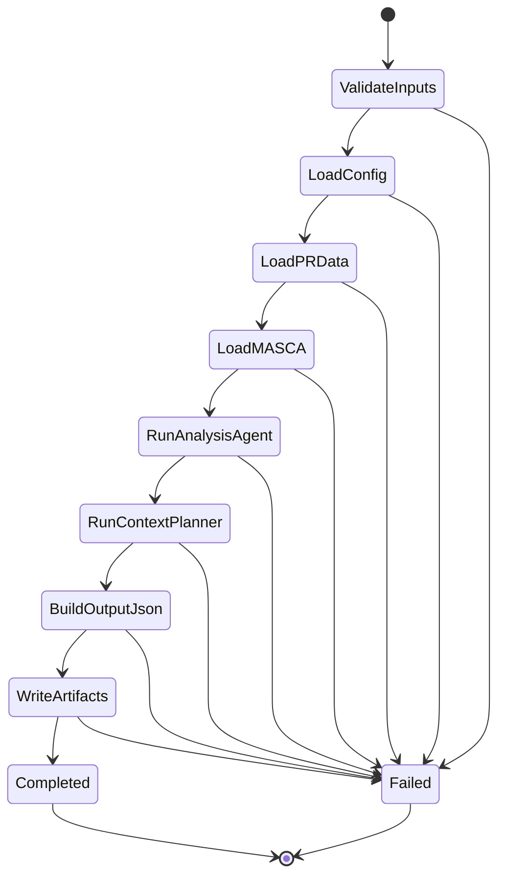

# GenAI Architecture

## Overview

`GenAI` is organized as a PR-planning pipeline around one core orchestrator, `PRStepPlanner`. The module separates discovery from planning:

- Phase 1 decides what must change.
- Phase 2 decides how to change it.
- Supporting modules handle context generation, batch execution, evaluation, configuration, and safe file access.

This keeps the planning pipeline modular: orchestration is in one place, agent tools are isolated, and evaluation is independent from generation.

## System Architecture

## Responsibilities By Module

- `pr_step_planner.py`: the primary runtime. It validates the PR directory, loads PR metadata, resolves MASCA context, runs both agents, and writes normalized outputs.
- `tools.py`: shared low-level file and directory tools. `pr_step_planner.py` wraps them into sandboxed agent tools so agents only read allowed paths.
- `config_loader.py`: loads `agents_config.toml`, validates it with Pydantic, and caches the result.
- `batch_predict.py`: runs the planner over many `pr_*` directories, sequentially or with a thread pool.
- `single_agent_runner.py`: baseline path for experiments that remove the two-phase split.
- `masca_runner.py`: generates project-level context from README content plus a directory tree.
- `evaluate_predictions.py`: post-run evaluation layer. It is intentionally decoupled from generation so prediction and scoring can evolve independently.
- `utils.py`: provides `run_async_safely`, which lets the module run async agent workflows from CLI-style synchronous entry points.

## Two-Agent Runtime

The main pipeline is intentionally staged:

1. `PRStepPlanner` loads `data.json`, `base_project/`, optional MASCA analysis, and model settings.
2. The Analysis Agent receives the PR title/body and MASCA context.
3. The Analysis Agent uses sandboxed base-project tools to inspect code and returns structured `AnalysisOutput`.
4. The Context Planner Agent receives that structured output.
5. The Context Planner Agent uses context files and the call graph to expand targets into a `StepPlan`.
6. The planner persists the final prediction, token summary, and full session log.

## State Transitions

## Data Boundaries

The module has three important data contracts:

- `AnalysisOutput`: intermediate contract from phase 1, containing files, functions, and reasoning.
- `PlannerOutput`: final typed plan contract, centered on `StepPlan`.
- `SessionLog`: observability contract, capturing prompts, tool calls, retries, timings, and token usage.

This separation is useful because generation quality, evaluation logic, and dashboards can change without collapsing into one format.

## Evaluation Architecture

Evaluation is not part of the planning runtime. It is a separate pass over saved artifacts:

- prediction input: `predicted_plan.json`
- reference input: `ground_truth.json`
- outputs: `evaluation_score.json` or aggregated batch reports

The evaluator mixes exact and semantic checks:

- deterministic file matching
- deterministic function matching
- step-count and target-coverage analysis
- optional embedding-based semantic similarity

That design makes the scoring path reproducible for structure-level metrics while still allowing a softer semantic comparison for natural-language plan quality.

## How This Module Is Used In The Project

Within the full repository, `GenAI/` is the prediction layer between preprocessing and scoring:

- Upstream, `context_retrieving/` prepares `call_graph.json`, `context_files/*`, `project_tree.txt`, and optional MASCA output that the planners use as structured context.
- At the schema boundary, `GenAI/pr_step_planner.py` and `GenAI/single_agent_runner.py` import `Step` and `StepPlan` from `evaluation.models`, which keeps predicted plans aligned with the evaluation format.
- At the interface layer, `cli/handlers/prediction.py` calls `GenAI.batch_predict.run_batch(...)` for interactive batch inference, and `cli/handlers/repository.py` reuses `GenAI.masca_runner` when building repository summaries.
- Downstream, `GenAI/evaluate_predictions.py` compares `predicted_plan.json` to `ground_truth.json` and writes `evaluation_score.json`.
- Finally, `dashboard/server.py` consumes `predicted_plan.json`, `evaluation_score.json`, `token_usage.json`, and `session_log.json` to power result browsing and drill-down views.
