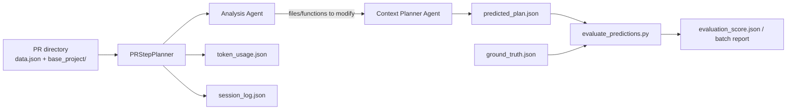
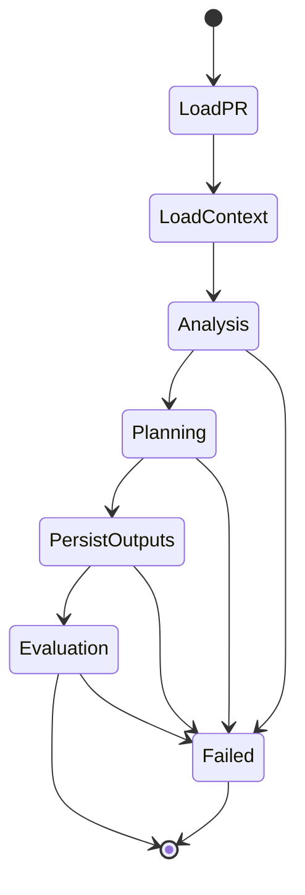

# GenAI

`GenAI` is the planning and evaluation module for PR-centric code-change prediction. It reads pull request metadata plus a prepared repository snapshot, runs an LLM-based planning pipeline, and produces structured JSON outputs that can be evaluated against ground truth.

## What It Does

- Generates `predicted_plan.json` for a single PR or a batch of PRs.
- Uses a two-phase agent pipeline to identify targets and turn them into step-by-step implementation plans.
- Stores token usage and a full execution trace for later analysis.
- Evaluates predictions with deterministic metrics and optional semantic similarity.
- Includes a single-agent baseline for ablation studies.

## Main Flow

## Execution States

## Key Files

- `pr_step_planner.py`: main two-agent orchestrator and JSON/session output writer.
- `batch_predict.py`: discovers PR folders and runs the planner at scale.
- `single_agent_runner.py`: ablation baseline with one agent instead of two phases.
- `evaluate_predictions.py`: computes file/function F1, step coverage, and optional semantic scores.
- `masca_runner.py`: generates high-level project context from a README and directory tree.
- `tools.py`: sandboxed file-reading and directory-listing tools used by agents.
- `config_loader.py` + `agents_config.toml`: typed model configuration with per-agent overrides.
- `utils.py`: shared async/sync bridge helpers.

## Inputs And Outputs

Input PR folders are expected to contain at least:

- `data.json`
- `base_project/`
- optionally `base_project/context_output/` with `masca_analysis.md`, `call_graph.json`, and `context_files/`

Main outputs:

- `predicted_plan.json`
- `token_usage.json`
- `session_log.json`
- `evaluation_score.json` or a batch evaluation report

## How This Module Is Used In The Project

- `context_retrieving/` runs before `GenAI/` and produces the context artifacts this module consumes, especially `call_graph.json`, `context_files/*`, `project_tree.txt`, and optional `masca_analysis.md`.
- `evaluation/models.py` provides the shared `Step` and `StepPlan` schema, so `GenAI` predictions follow the same structure used for ground truth.
- `cli/handlers/prediction.py` exposes `GenAI.batch_predict` as the interactive prediction entry point, while `cli/handlers/repository.py` reuses `GenAI.masca_runner` during repository analysis.
- `GenAI.evaluate_predictions` is the downstream scorer for this module’s outputs, comparing `predicted_plan.json` with `ground_truth.json`.
- `dashboard/server.py` reads `predicted_plan.json`, `evaluation_score.json`, `token_usage.json`, and `session_log.json` to show per-PR results and aggregated analysis.
