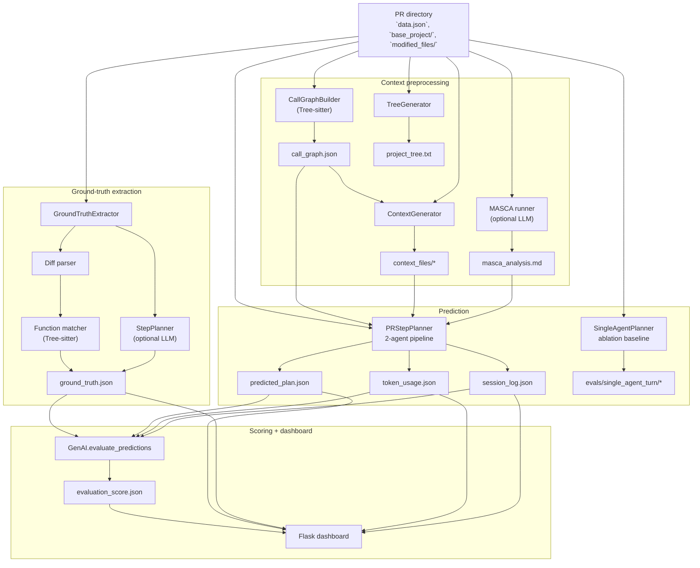
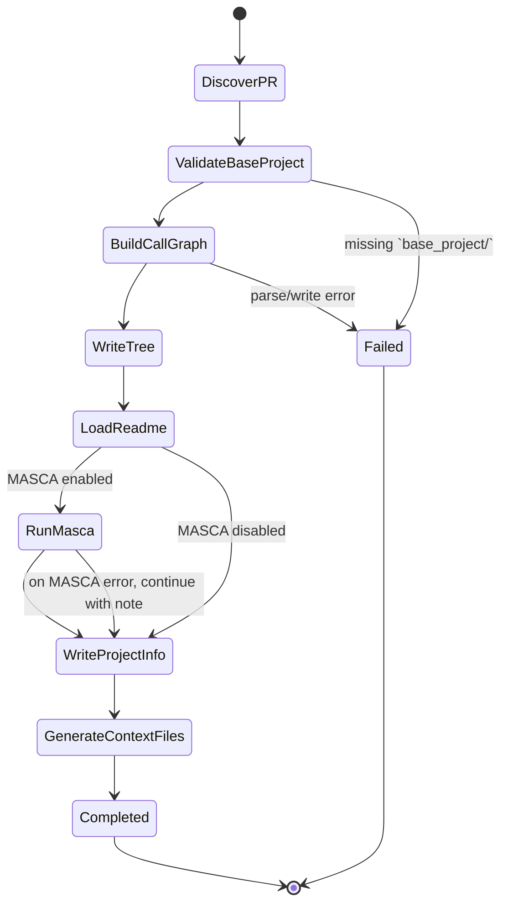
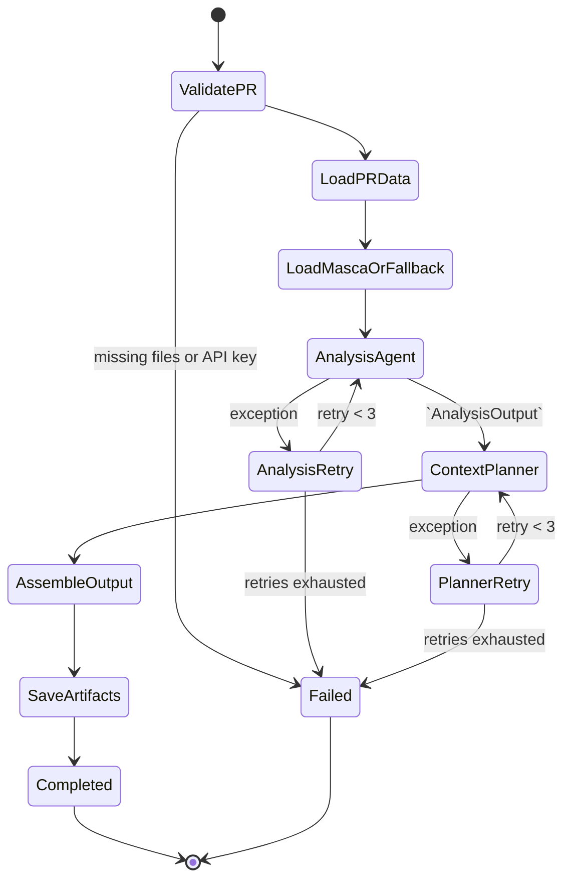

# Architecture

This repository is built around a simple idea: each PR directory is the system boundary, and almost every subsystem communicates by reading or writing files inside that directory. There is no database or message bus; the architecture is a set of offline pipelines connected by JSON and text artifacts.

## Layers

| Layer | Responsibility | Main modules |
| --- | --- | --- |
| Interface | Interactive entry points and result browsing | `cli/app.py`, `cli/handlers/*`, `dashboard/server.py` |
| Static analysis | Parse Python code, build call graphs, generate function context | `context_retrieving/call_graph_builder.py`, `context_retrieving/context_generator.py`, `context_retrieving/generate_tree.py` |
| LLM orchestration | Build project summaries and predicted implementation plans | `GenAI/masca_runner.py`, `GenAI/pr_step_planner.py`, `GenAI/single_agent_runner.py`, `GenAI/tools.py` |
| Ground truth | Extract canonical changed files/functions and optional step plans | `evaluation/ground_truth_extractor.py`, `evaluation/diff_parser.py`, `evaluation/function_matcher.py`, `evaluation/step_planner.py` |
| Scoring | Compare predictions to ground truth and aggregate metrics | `GenAI/evaluate_predictions.py` |
| Configuration | Model selection and CLI defaults | `GenAI/config_loader.py`, `GenAI/agents_config.toml`, `cli/config.py` |

## End-to-End View

## Main Pipelines

### 1. Context preprocessing

`context_retrieving/batch_context_retriever.py` is the offline preprocessing stage. For each PR snapshot it:

1. analyzes `base_project/` with `CallGraphBuilder`
2. writes `call_graph.json`
3. generates `project_tree.txt`
4. optionally runs MASCA from README + tree
5. writes `project_info.py`
6. generates one context file per function through `ContextGenerator`

This stage is what turns a raw repository snapshot into AI-ready context.

### 2. Ground-truth extraction

`evaluation/ground_truth_extractor.py` builds the canonical target for scoring:

- `pr_loader.py` loads PR metadata
- `diff_parser.py` converts unified diffs into changed-line sets
- `function_matcher.py` maps changed lines to Python functions using Tree-sitter
- `step_planner.py` optionally adds a natural-language step plan

The output is `ground_truth.json`, which becomes the reference for every later evaluation.

### 3. Two-agent prediction pipeline

`GenAI/pr_step_planner.py` is the main runtime planner. It loads PR metadata, resolves project context, runs two agents in sequence, and writes both the prediction and a detailed execution trace.

- Agent 1: `analysis_agent`
  Reads PR title/body plus MASCA context, explores `base_project/`, and returns `AnalysisOutput` with files/functions to modify.
- Agent 2: `context_planner_agent`
  Reads the analysis handoff, then queries `context_files/*` and `call_graph.json` to produce the final `StepPlan`.
- Tooling layer:
  `GenAI/tools.py` provides sandboxed file/directory tools. In the main path, `read_base_project_file` adds an inline LLM summarization pass before returning file content to the analysis agent.
- Persistence:
  The planner writes `predicted_plan.json`, `token_usage.json`, and `session_log.json`.

### 4. Single-agent ablation

`GenAI/single_agent_runner.py` is the baseline used for ablation studies. It keeps the same artifact format as the main planner but runs a single agent and writes into `pr_dir/evals/single_agent_turn/` or a consolidated eval directory.

### 5. Scoring and dashboard

`GenAI/evaluate_predictions.py` compares prediction artifacts against `ground_truth.json` and computes:

- file precision / recall / F1
- function precision / recall / F1
- step-count and target-coverage metrics
- optional semantic similarity using OpenAI embeddings

`dashboard/server.py` is a thin Flask layer over generated JSON files. It serves:

- `/api/datasets`
- `/api/summary`
- `/api/prs`
- `/api/pr/<repo>/<pr>`

The frontend is a static page in `dashboard/static/index.html` that consumes those APIs.

## Artifact Contract

| Artifact | Producer | Main consumers |
| --- | --- | --- |
| `context_output/call_graph.json` | `CallGraphBuilder` via `batch_context_retriever` | `ContextGenerator`, planner context tools |
| `context_output/context_files/*` | `ContextGenerator` | `context_planner_agent` |
| `context_output/masca_analysis.md` | `masca_runner.py` | `analysis_agent` |
| `ground_truth.json` | `GroundTruthExtractor` | `evaluate_predictions.py`, dashboard |
| `predicted_plan.json` | `PRStepPlanner` or `SingleAgentPlanner` | `evaluate_predictions.py`, dashboard |
| `token_usage.json` | planner runners | dashboard, evaluation summaries |
| `session_log.json` | planner runners | dashboard drill-down views |
| `evaluation_score.json` | `evaluate_predictions.py` | dashboard |

## Code-Level Notes

These are important if you are changing the architecture rather than just using it:

- The system is tightly coupled through the filesystem. Pipeline boundaries are files, not in-memory service APIs.
- `context_retrieving/batch_context_retriever.py` writes context artifacts to `pr_dir/context_output`, while `GenAI/pr_step_planner.py` and `GenAI/single_agent_runner.py` currently read from `base_project/context_output`.
- `GenAI/single_agent_runner.py` builds both base-project tools and context tools, but the instantiated agent currently receives only `base_tools`.

Those last two points are not documentation assumptions; they are the current wiring visible in the codebase.
