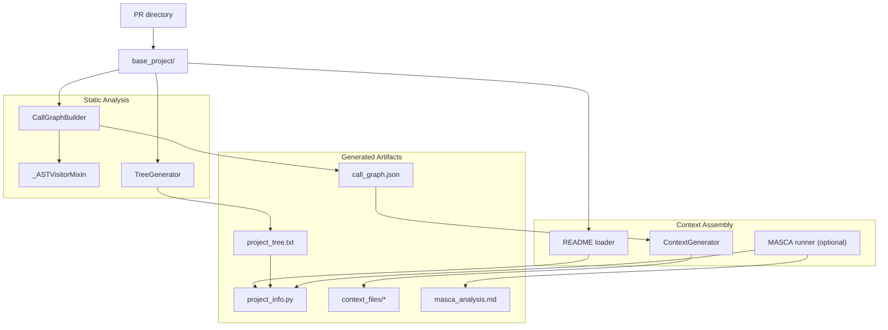
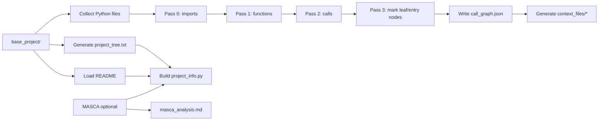
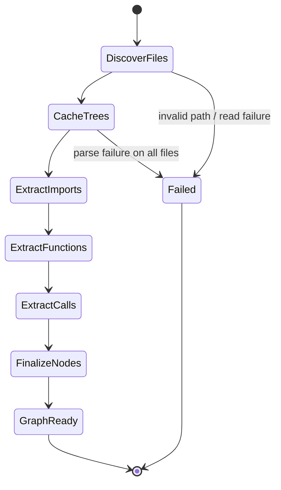
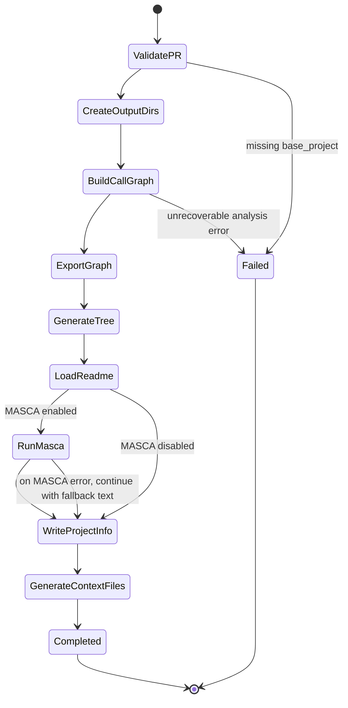

# Context Retrieving Architecture

## Overview

`context_retrieving/` converts a raw Python repository snapshot into a compact set of artifacts that describe structure, code relationships, and function-level context. The module is file-oriented: each stage reads from the repository snapshot and writes explicit outputs to disk, with `batch_context_retriever.py` acting as the top-level coordinator.

## Component View

## Processing Pipeline

The module follows a simple pipeline:

1. `CallGraphBuilder` scans every `.py` file under `base_project/`.
2. `_ASTVisitorMixin` performs import extraction, function discovery, call extraction, and name resolution.
3. `TreeGenerator` builds a filtered filesystem tree.
4. `batch_context_retriever.py` loads the repository README and optionally runs MASCA.
5. `ContextGenerator` expands each function into a context bundle with dependencies and callers.
6. The final artifacts are written under `context_output/`.

## State Transitions

### 1. Repository analysis state machine

This is the internal state flow of `CallGraphBuilder.analyze_repository()`:

### 2. Batch context generation state machine

This is the end-to-end state flow of `BatchContextRetriever.process_pr()`:

## Core Data Structures

### Call graph node

Each function is stored under a fully qualified name such as `module.Class.method` with:

- `file`
- `line`
- `calls`
- `called_by`
- `code`
- `is_leaf`
- `is_entry_point`
- `class_name`
- `is_method`
- `full_name`

This structure is the contract between `CallGraphBuilder` and `ContextGenerator`.

### Context file layout

For each function, `ContextGenerator` writes:

- `{function}_context.txt`: dependency code, target code, caller snippets
- `{function}_metadata.json`: structured metadata for downstream tools

The output mirrors the source repository layout by turning each source file into a directory inside `context_files/`.

## Design Notes

- The analysis is static, not runtime-based. Only relationships visible in the source tree are captured.
- Name resolution is heuristic. Imports, local-module functions, class methods, and suffix matches are tried in order.
- The four-pass builder is the critical design choice: calls are extracted only after all functions are known.
- `TreeGenerator` and `ContextGenerator` are intentionally independent from LLM logic; only MASCA is optional and external.

## How This Module Is Used In The Project

In the full project, `context_retrieving/` is the preprocessing layer for PR dataset snapshots. The `GenAI/` planning pipeline depends on the artifacts written here, especially `call_graph.json`, `context_files/*`, `project_tree.txt`, and optional MASCA output, to give agents a smaller and more structured view of each repository before they generate implementation plans.
