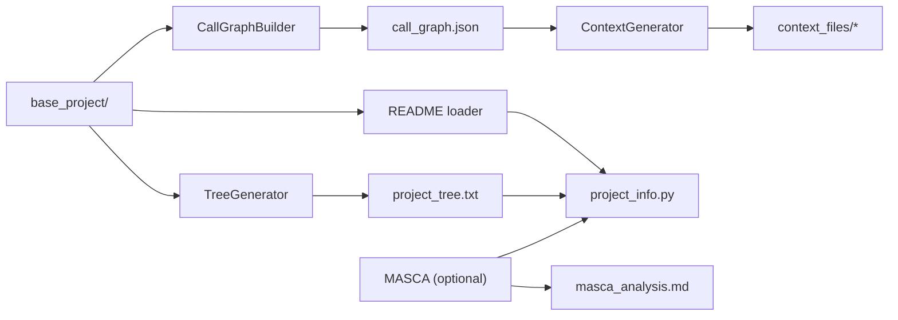

# Context Retrieving

`context_retrieving/` is the static-analysis and context-building module for this project. It scans a Python repository snapshot, builds a function-level call graph, generates a filtered directory tree, and writes per-function context files that are easier for LLM-based planners to consume.

## What It Produces

Given a PR dataset entry with a `base_project/` directory, the module writes a `context_output/` folder containing:

- `call_graph.json`: function metadata plus caller/callee edges
- `project_tree.txt`: filtered ASCII tree of the repository
- `project_info.py`: embedded tree, README, and optional MASCA summary
- `context_files/`: one `_context.txt` and one `_metadata.json` per function
- `masca_analysis.md`: optional LLM-generated repository summary



## Main Modules

- `call_graph_builder.py`: parses Python files with Tree-sitter and builds the call graph in four passes
- `_ast_visitors.py`: holds the AST traversal and name-resolution logic used by the builder
- `context_generator.py`: creates per-function context and metadata files from the call graph
- `generate_tree.py`: generates an ASCII tree with ignore rules and basic stats
- `_tree_cli.py`: interactive CLI wrapper for the tree generator
- `batch_context_retriever.py`: dataset-oriented orchestrator for end-to-end context generation

## Typical Usage

Build context artifacts for a PR4Code dataset folder:

```bash
python -m context_retrieving.batch_context_retriever PR4Code/dataset_pr_commits_py/ --limit 10
```

Disable MASCA if you only want static artifacts:

```bash
python -m context_retrieving.batch_context_retriever PR4Code/dataset_pr_commits_py/ --no-masca
```

Use the call-graph and context generation classes directly:

```python
from context_retrieving import CallGraphBuilder, ContextGenerator

builder = CallGraphBuilder()
graph = builder.analyze_repository("/path/to/repo")

generator = ContextGenerator(graph, repo_root="/path/to/repo")
generator.generate_all_context_files("/tmp/context_files")
```

## How This Module Is Used In The Project

Inside the full project, `context_retrieving/` is the preprocessing stage. It runs before the `GenAI/` planners and turns each PR's `base_project/` snapshot into structured artifacts that the planners can read instead of exploring the raw repository from scratch. The most important outputs consumed elsewhere are `call_graph.json`, `context_files/*`, `project_tree.txt`, and the optional `masca_analysis.md`.
