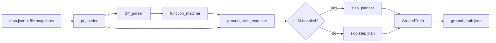

# Evaluation Module

`evaluation/` extracts structured ground truth from pull request snapshots so the project can evaluate implementation plans against what actually changed.

## What It Does

- Loads a PR snapshot from `data.json` plus the `modified_files/` and `original_files/` folders.
- Parses unified diffs to identify changed lines.
- Maps changed Python lines to functions with Tree-sitter.
- Optionally asks an LLM to convert the PR into an ordered `StepPlan`.
- Saves the result as `ground_truth.json`.

## Flow



## Main Files

- `ground_truth_extractor.py`: orchestration and CLI entry point.
- `pr_loader.py`: reads `data.json`, resolves file paths, saves output.
- `diff_parser.py`: converts unified diff patches into changed-line coordinates.
- `function_matcher.py`: finds modified Python functions from changed lines.
- `step_planner.py`: optional LLM-backed step-plan generation.
- `models.py`: shared Pydantic schema for extraction output.

## Output Shape

The module writes one `GroundTruth` object per PR, containing:

- PR metadata
- extraction status and timestamp
- modified files
- modified functions
- optional step plan

## Run

```bash
python -m evaluation.ground_truth_extractor <path-to-pr-or-dataset>
python -m evaluation.ground_truth_extractor <path> --no-llm
python -m evaluation.ground_truth_extractor <path> --skip-existing --limit 10
```

## Notes

- Python files are analyzed at function level.
- Non-Python files are tracked at file level only.
- Failures are recorded in `ground_truth.json` instead of aborting the whole run.

## How This Module Is Used In The Project

- It is the project’s reference extractor: `ground_truth.json` is the canonical target used to judge predicted plans.
- The CLI exposes it through `cli/handlers/extraction.py`, which instantiates `GroundTruthExtractor` for batch dataset runs.
- `GenAI/batch_predict.py` and `GenAI/pr_step_planner.py` generate `predicted_plan.json` files that are designed to be schema-compatible with this module’s output.
- `GenAI/evaluate_predictions.py` compares predictions against `ground_truth.json` and writes `evaluation_score.json`.
- `dashboard/server.py` loads `ground_truth.json` alongside predictions, scores, token logs, and session logs for inspection.
- `context_retrieving/batch_context_retriever.py` assumes ground truth may already exist in each PR directory and then builds the extra context artifacts used by the planners.
