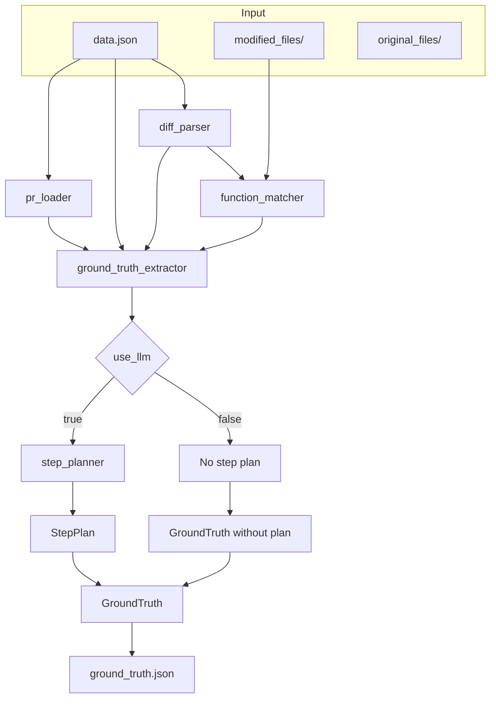
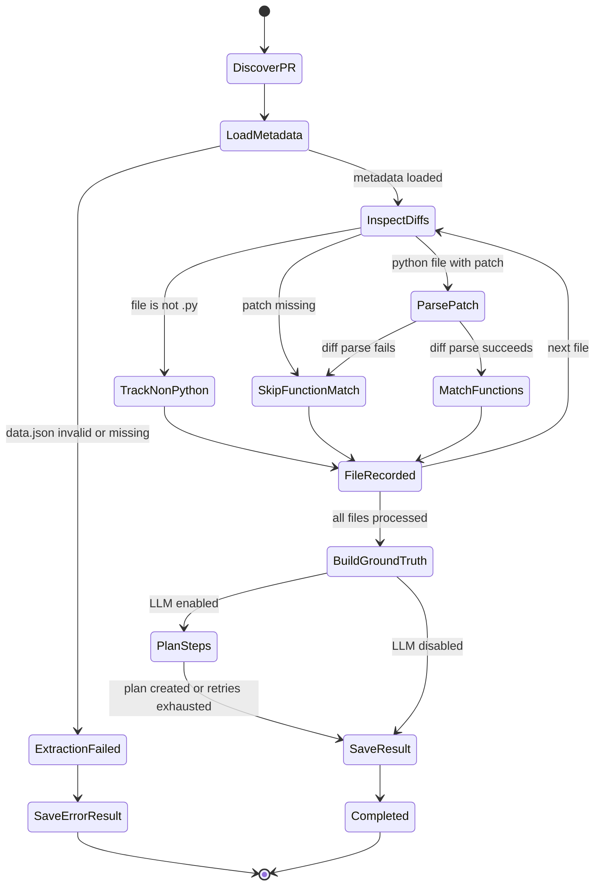
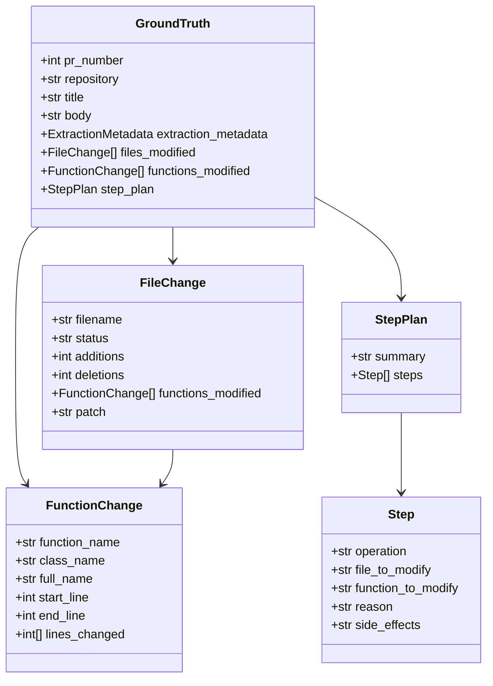
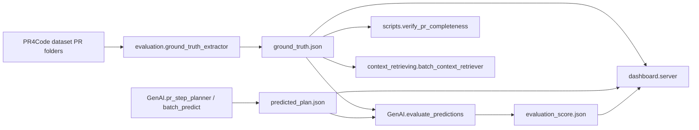

# Evaluation Architecture

## Purpose

The `evaluation/` package turns a pull request snapshot into a deterministic, machine-readable record of what changed, then optionally adds an LLM-generated implementation plan. Its core job is to bridge three views of the same PR:

- dataset metadata from `data.json`
- textual code changes from Git patches
- structural code changes from Python AST parsing

## Component Diagram

## End-to-End Flow

1. `pr_loader.py` validates and exposes PR metadata through `PRData`.
2. `ground_truth_extractor.py` iterates each diff entry from the PR.
3. `diff_parser.py` converts each patch into added and deleted line numbers.
4. `function_matcher.py` parses the modified Python file with Tree-sitter and matches changed lines to function ranges.
5. `ground_truth_extractor.py` assembles `FileChange`, flattens all `FunctionChange` records, and builds `GroundTruth`.
6. If LLM mode is enabled, `step_planner.py` builds prompt context from the PR and requests a validated `StepPlan`.
7. `pr_loader.py` serializes the final object to `ground_truth.json`.

## State Transitions

## Responsibilities By Module

### `ground_truth_extractor.py`

Owns the pipeline. It is the only module that sees the full PR lifecycle: load, parse, match, optionally plan, then save.

### `pr_loader.py`

Provides safe dataset I/O. It validates `data.json`, resolves file paths inside `modified_files/` and `original_files/`, and writes `ground_truth.json`.

### `diff_parser.py`

Transforms unified diff text into structured coordinates. Its output is line-based, not syntax-aware.

### `function_matcher.py`

Adds syntax awareness for Python files. It extracts function ranges from the modified file and intersects them with the changed lines produced by the diff parser.

### `step_planner.py`

Adds an optional semantic layer. It summarizes the PR context for an LLM and requests a structured `StepPlan`, with retry logic around transient failures.

### `models.py`

Defines the contract shared by the entire package. `GroundTruth` is the root object; `FileChange`, `FunctionChange`, `Step`, and `StepPlan` are the main nested records.

## Data Model

## Design Choices

- Deterministic extraction first, probabilistic planning second. File and function extraction do not depend on the LLM.
- New-file coordinates drive function matching. Changed lines are matched against `modified_files/`, because diff additions refer to the post-change file.
- Partial failure is preserved. If extraction fails, the package still writes an error-marked `ground_truth.json` for traceability.
- Step count is derived from extracted structure. Python functions count individually; files without matched functions fall back to one step per file.

## How This Module Is Used In The Project

At repository level, `evaluation/` is the source of truth layer for the benchmark. Other subsystems either prepare inputs for it, produce outputs meant to be compared against it, or visualize the scores derived from it.

### Integration Points

- `cli/handlers/extraction.py` is the interactive entry point. It scans dataset folders and runs `GroundTruthExtractor` over valid PR directories.
- `context_retrieving/batch_context_retriever.py` operates on the same PR folders and documents `ground_truth.json` as an already-generated artifact in the dataset workflow.
- `GenAI/pr_step_planner.py` and `GenAI/single_agent_runner.py` import `Step` and `StepPlan` from `evaluation.models`, so predicted plans and ground-truth plans share the same schema.
- `GenAI/batch_predict.py` generates `predicted_plan.json` in bulk, explicitly framing those outputs as artifacts to compare with `ground_truth.json`.
- `GenAI/evaluate_predictions.py` is the direct downstream consumer. It reads `ground_truth.json` and `predicted_plan.json`, computes file/function/step/semantic metrics, and saves `evaluation_score.json`.
- `dashboard/server.py` loads `ground_truth.json`, `predicted_plan.json`, `evaluation_score.json`, `token_usage.json`, and `session_log.json` together to present per-PR results and aggregate analysis.
- `scripts/verify_pr_completeness.py` uses the presence of `ground_truth.json` to discover PR directories and then checks whether related artifacts such as `base_project/` and `context_output/` are also present.

### Practical Role In The Pipeline

1. Dataset PR snapshots enter the system through `PR4Code/.../pr_xxx/`.
2. `evaluation/` writes the canonical description of what actually changed.
3. Planner modules generate a proposed implementation plan in the same schema family.
4. The evaluator scores prediction quality against this module’s output.
5. The dashboard and utility scripts surface those results for analysis and maintenance.
