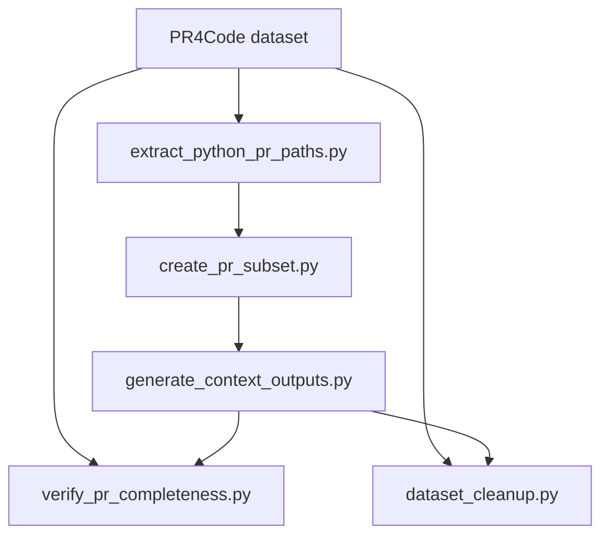
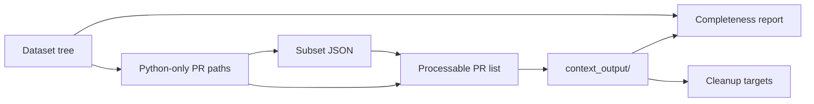
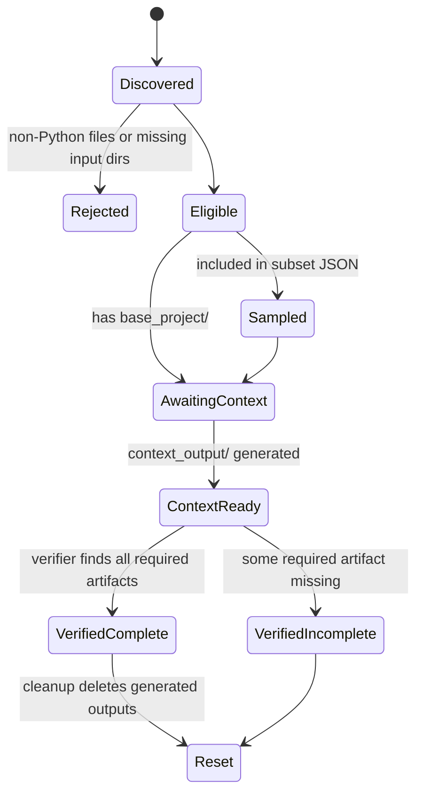
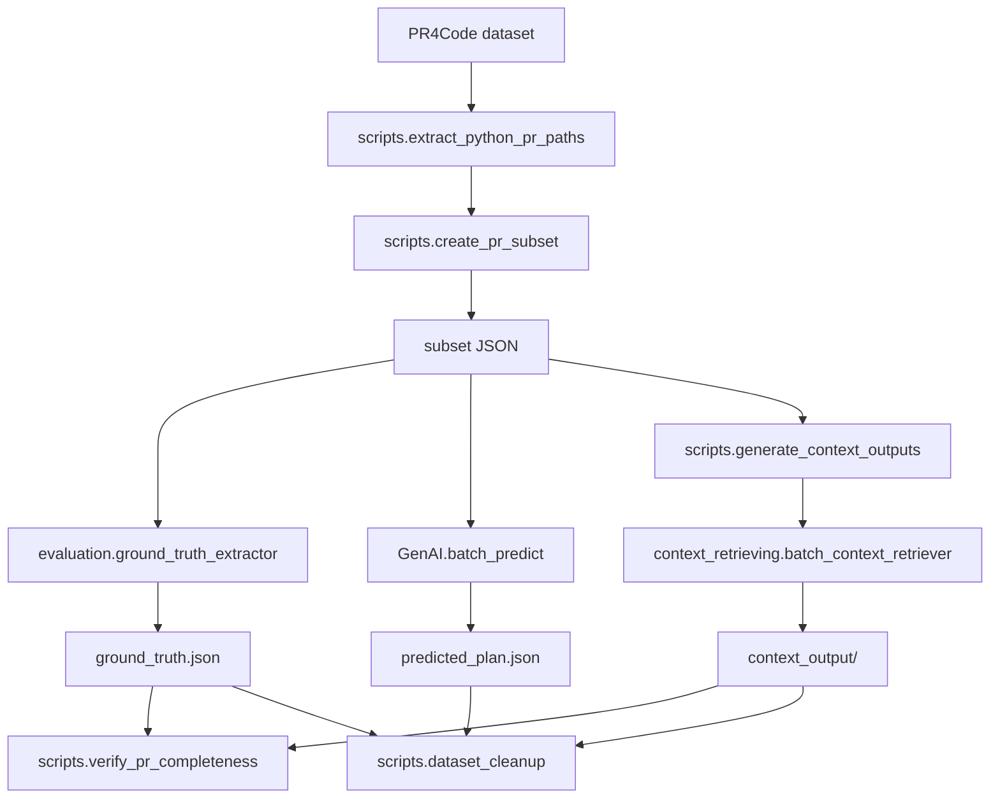

# Scripts Architecture

## Purpose

The `scripts/` package is the dataset orchestration layer of the project. It does not perform model evaluation itself; it prepares, enriches, validates, and cleans the PR dataset that the rest of the codebase operates on.

## Architectural Shape

The module follows a simple pipeline architecture with two standalone service scripts:

### Layer Responsibilities

1. Discovery layer
   `extract_python_pr_paths.py` scans repository and PR folders, enforcing the first gate: only PRs with files in both `modified_files/` and `original_files/`, and only `.py` files, pass through.

2. Selection layer
   `create_pr_subset.py` converts the full eligible population into a reproducible sample. It groups PRs by repository, keeps repository diversity by selecting one PR per repo, records metadata, and can exclude repositories already used in previous subsets.

3. Enrichment layer
   `generate_context_outputs.py` turns selected or discovered PRs into richer working units by creating `context_output/`. This script is the bridge between `scripts/` and the project’s context-retrieval subsystem.

4. Operations layer
   `verify_pr_completeness.py` and `dataset_cleanup.py` are operational tools. One measures dataset readiness; the other resets generated artifacts so the pipeline can be rerun safely.

## Data Flow

### Core Artifacts

| Artifact | Produced By | Used For |
| --- | --- | --- |
| Python-only PR path list | `extract_python_pr_paths.py` | Candidate discovery |
| Subset JSON | `create_pr_subset.py` | Reproducible batch runs |
| `context_output/` | `generate_context_outputs.py` | Downstream context-aware processing |
| Completeness report | `verify_pr_completeness.py` | QA and repair decisions |
| Deleted target set | `dataset_cleanup.py` | Dataset reset and reruns |

## State Transitions

The scripts encode a dataset lifecycle more than an object model. A PR moves through a small number of explicit filesystem states:

This is intentionally filesystem-driven. The scripts do not maintain a database or long-lived service state; the directory structure is the source of truth.

## Design Notes

- The package is low ceremony by design: each script can run as a CLI and most logic is exposed as plain Python functions.
- Dependencies inside `scripts/` are shallow: `extract_python_pr_paths.py` is the base utility, `create_pr_subset.py` builds on it, and `generate_context_outputs.py` optionally consumes its subset output.
- Operational scripts stay independent so they can be used at any point in the workflow without requiring the full pipeline to run first.

## How This Module Is Used In The Project

At repository level, `scripts/` is not the core analysis engine. Its role is to sit around the main subsystems and provide dataset selection, orchestration convenience, validation, and cleanup.

### Integration Points

- CLI integration: the Rich CLI imports `scripts.create_pr_subset`, `scripts.extract_python_pr_paths`, `scripts.verify_pr_completeness`, and `scripts.dataset_cleanup` directly through `cli/handlers/subset.py`, `cli/handlers/verification.py`, and `cli/handlers/cleanup.py`.
- Context integration: `scripts.generate_context_outputs.py` delegates the actual work to `context_retrieving.batch_context_retriever.BatchContextRetriever`, so it is a script-layer entry point rather than the underlying context engine.
- Evaluation integration: `evaluation.ground_truth_extractor` accepts a `--subset` file and imports `load_pr_subset()` from `scripts.create_pr_subset`, which keeps extraction aligned with the same reproducible PR sample.
- Prediction integration: `GenAI.batch_predict` uses the same `load_pr_subset()` helper, so prediction runs and ground-truth extraction can target the same PR population.
- Maintenance integration: `scripts.verify_pr_completeness.py` checks whether PR folders already contain the artifacts later stages expect, and `scripts.dataset_cleanup.py` removes generated files such as `ground_truth.json`, `predicted_plan.json`, and `context_output/`.

### Practical Meaning

In practice, the rest of the repository treats `scripts/` as the operational shell around the benchmark:

1. Select or filter a stable set of PR directories.
2. Pass that same set into extraction, context generation, or prediction.
3. Verify that the filesystem artifacts are complete.
4. Clean generated outputs when the benchmark needs a fresh run.
