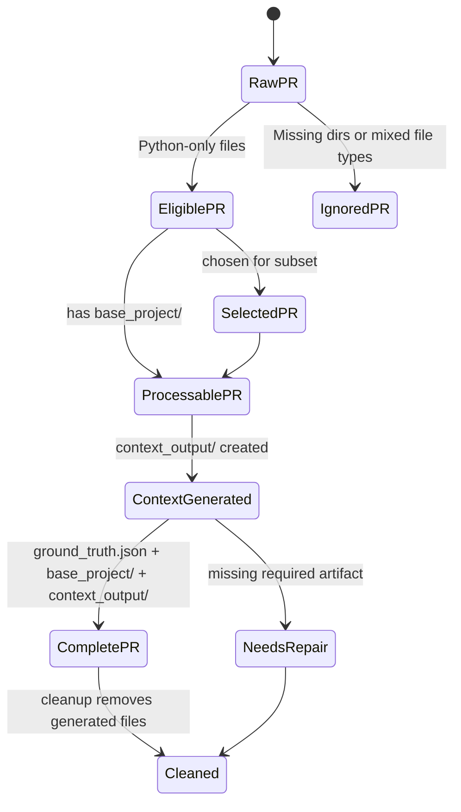
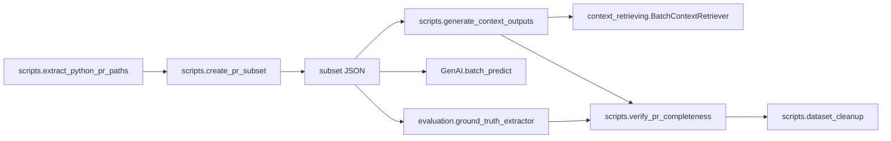

# Scripts

This directory contains the dataset utility layer for the project. The scripts are small CLI tools that filter PRs, build reproducible subsets, generate derived context files, verify dataset completeness, and remove generated artifacts when the dataset needs to be reset.

## What Is Here

| Script | Role |
| --- | --- |
| `extract_python_pr_paths.py` | Finds PR folders whose `modified_files/` and `original_files/` contain only Python files. |
| `create_pr_subset.py` | Builds a reproducible subset of PRs, selecting at most one PR per repository. |
| `generate_context_outputs.py` | Generates `context_output/` for PRs that can be processed. |
| `verify_pr_completeness.py` | Checks whether a PR has the expected analysis artifacts. |
| `dataset_cleanup.py` | Deletes generated files or folders in dry-run or delete mode. |

## Typical Workflow

The scripts are intentionally loosely coupled. `extract_python_pr_paths.py` is the base filter, `create_pr_subset.py` depends on it, and `generate_context_outputs.py` consumes the subset when the workflow needs deterministic sampling. `verify_pr_completeness.py` and `dataset_cleanup.py` are independent operational utilities.

## State Model

For a fuller explanation of responsibilities and boundaries, see [architecture.md](/Users/davidecroatto/code/planningtest0/scripts/architecture.md).

## How This Module Is Used In The Project

Within the full repository, `scripts/` acts as the dataset operations layer around the main processing pipeline. It is used to choose which PRs to work on, to feed reproducible subsets into later stages, to check whether derived artifacts exist, and to remove generated outputs when the dataset must be rerun.

- `cli/handlers/subset.py`, `cli/handlers/verification.py`, and `cli/handlers/cleanup.py` import these script modules directly for the interactive CLI.
- `evaluation/ground_truth_extractor.py` and `GenAI/batch_predict.py` reuse `create_pr_subset.load_pr_subset()` to run against the same fixed PR selection.
- `generate_context_outputs.py` is a thin wrapper over `context_retrieving.batch_context_retriever`, so the scripts layer coordinates context generation without owning the lower-level analysis code.
