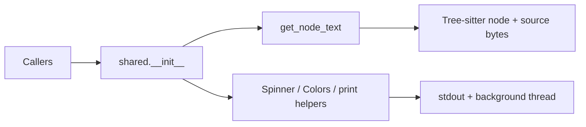
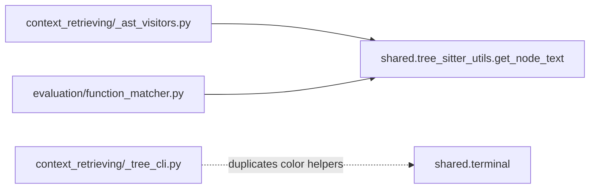

# Shared Utilities

`shared/` contains the small cross-cutting utilities reused by other modules in the project. It currently has two responsibilities:

- extracting source text from Tree-sitter nodes
- rendering simple terminal UI feedback

## What Is Inside

| File | Purpose |
| --- | --- |
| `tree_sitter_utils.py` | Converts a Tree-sitter node's byte range back into source text. |
| `terminal.py` | Provides ANSI colors, an animated spinner, and small print helpers. |
| `__init__.py` | Re-exports the public API so callers can import from `shared`. |

## Public API

```python
from shared import (
    get_node_text,
    Spinner,
    Colors,
    print_header,
    print_step,
    print_success,
    print_error,
)
```

## Module Shape



## Typical Usage

```python
source_bytes = source_code.encode("utf-8")
name = get_node_text(node, source_bytes)

spinner = Spinner("Building call graph")
spinner.start()
try:
    run_analysis()
finally:
    spinner.stop("Call graph ready")
```

## How This Module Is Used In The Project

`shared/` currently supports the project mainly through `get_node_text`:

- `context_retrieving/_ast_visitors.py` uses it while building the call graph, especially for import extraction, function-name extraction, and call resolution.
- `evaluation/function_matcher.py` uses the same helper to extract class names, function names, and full function bodies from modified files.

The terminal side is less integrated today:

- `shared/__init__.py` exposes `Spinner`, `Colors`, and the print helpers as a common CLI surface.
- the current codebase does not import those terminal helpers yet
- `context_retrieving/_tree_cli.py` defines its own `Colors` class instead of reusing `shared.terminal`


