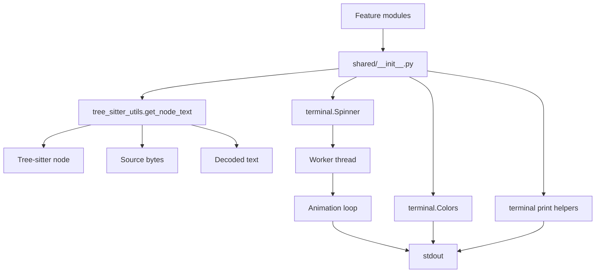
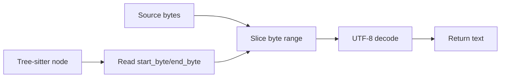
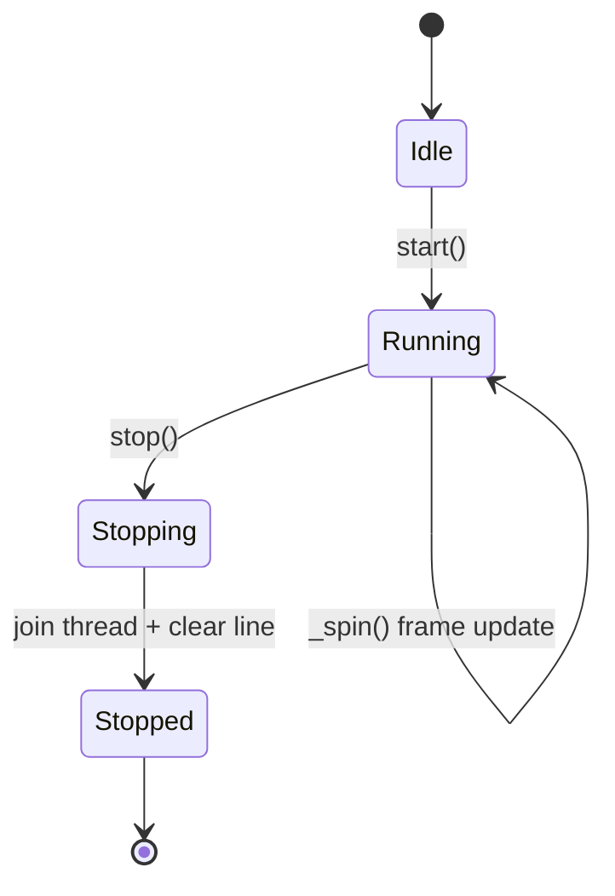
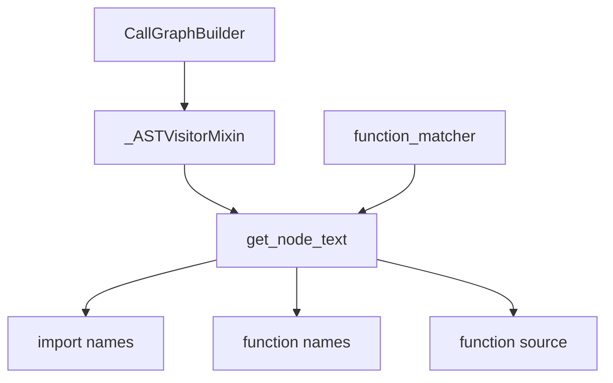

# Shared Module Architecture

## Overview

`shared/` is a lightweight support package. It does not own business logic. Instead, it provides:

1. a text-recovery helper for Tree-sitter AST nodes
2. a terminal presentation layer for long-running CLI steps

This keeps parsing code and CLI-facing code from duplicating the same low-level utilities.

## High-Level Architecture

## Component Responsibilities

### `tree_sitter_utils.py`

This module exposes a single function, `get_node_text(node, code_bytes)`.

Its job is simple:

1. read `start_byte` and `end_byte` from the Tree-sitter node
2. slice the original source bytes
3. decode the bytes into UTF-8 text
4. replace invalid bytes instead of failing hard

This design is intentionally narrow. Tree-sitter stores byte offsets, not source strings, so the helper centralizes the conversion in one place.

### `terminal.py`

This module groups terminal-facing utilities:

- `Colors`: ANSI escape code constants
- `Spinner`: animated progress indicator
- `print_header`, `print_step`, `print_success`, `print_error`: formatted output helpers

The terminal layer is intentionally separated from parsing helpers so non-UI logic can stay independent from console rendering.

## Spinner State Model

`Spinner` is the only stateful object in the package. Its lifecycle is explicit: create, start, animate, stop, clear, optionally print a final message.

## Runtime Flow

In practice the module behaves in two separate paths:

1. Parsing path: a caller already has a Tree-sitter node and the raw file bytes; `get_node_text` reconstructs the exact source fragment.
2. CLI path: a caller starts a spinner or prints formatted messages to make terminal output easier to read during long operations.

These paths are independent, but both are re-exported through `shared/__init__.py` so callers get a single import surface.

## Why This Design Works

- Low coupling: parsing helpers and terminal helpers are separate modules.
- Small public surface: `__init__.py` exposes only the utilities that other modules should consume.
- Minimal dependencies: the package relies only on Tree-sitter node metadata, Python stdlib threading, timing, and stdout.
- Failure tolerance: `get_node_text` uses replacement decoding, which avoids crashes on malformed byte sequences.

## How This Module Is Used In The Project

The current project uses `shared/` in a focused way:

1. `context_retrieving/call_graph_builder.py` delegates AST traversal to `_ASTVisitorMixin`.
2. `_ASTVisitorMixin` imports `shared.tree_sitter_utils.get_node_text`.
3. That helper reconstructs exact source fragments from Tree-sitter byte offsets while the call graph is built.
4. `evaluation/function_matcher.py` reuses the same helper to extract modified function metadata from changed files.

So the active integration is mostly on the parsing side, not the terminal side.

For terminal utilities, the picture is different:

- `shared.terminal` defines a reusable CLI presentation layer.
- no current production module imports `Spinner` or the print helpers.
- `context_retrieving/_tree_cli.py` keeps a separate local `Colors` implementation, so terminal formatting is not yet centralized.

This means the shared parsing utility is already part of the core analysis pipeline, while the shared terminal utility is available but not yet consistently adopted.
